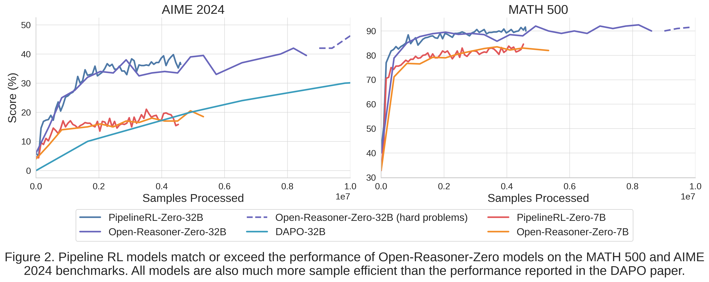
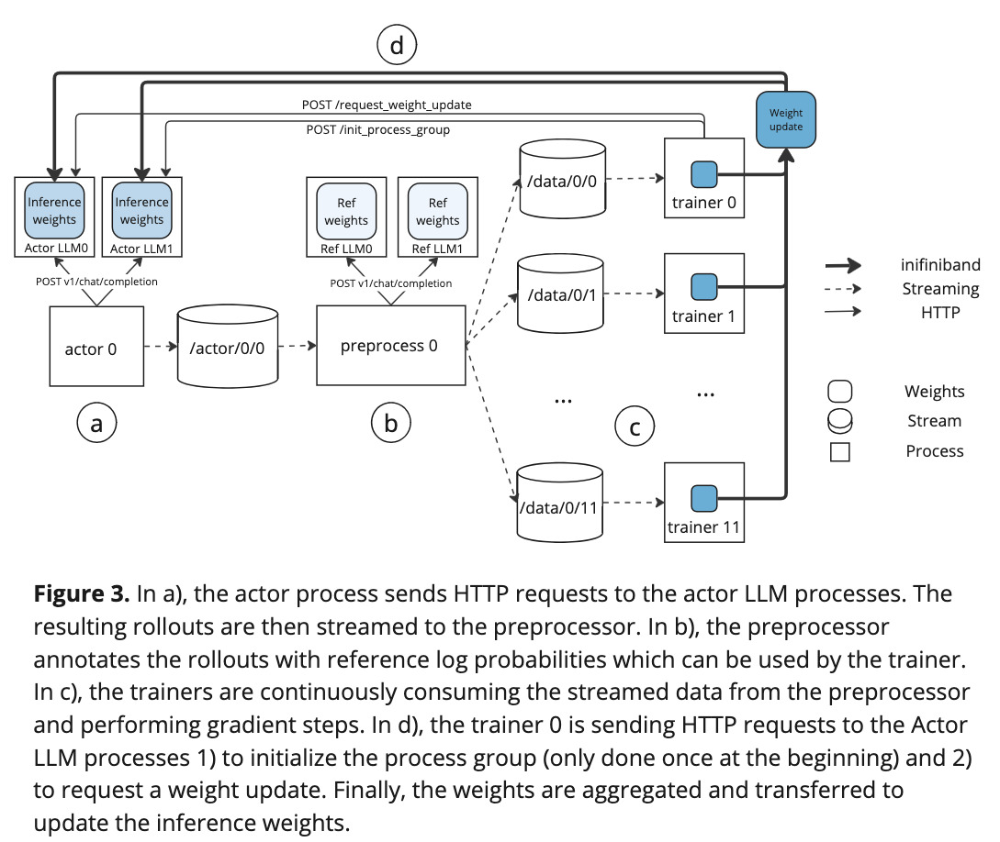

# CMU-AIRe Setup

## TODO List
[] Unify the data loading mechanism
[] Separate the logging mechanism for different dataset sources (e.g., different benchmarks)


- Follow the conda environment and other setup instructions below. 
- For multinode training use the file ```run_multi_slurm.sh```.
- For singlenode training use the file ```run_single_slurm.sh```.
- For configs, we have one main config in ```conf/base.yaml```. You can override this with your own, for example,  ```conf/pope.yaml```. The top of the config imports other configs, for example, the training configs are separate (in ```conf/finetune/base.yaml```) and are imported.

# HF cluster setup

Install the required dependencies from the root directory as follows:

```sh
# Dependencies for training
./install.sh

# Dependencies for local LLM grader server (optional)
./install_grader.sh
```

Then make sure you are authenticated with the Hugging Face Hub:

```sh
huggingface-cli login
```

## Sample command

To test your installation run:

```sh
python -m pipelinerl.launch --config-name=guessing output_dir=tmp/results/test_run/ 
```

## Launch Slurm jobs

To launch Slurm jobs, run:

```sh
sbatch --nodes=<num_nodes> run_hf.slurm --config <config_name> --job-name <job_name>
```

## Recipes

### Proof-verification pipeline

```sh
# Interactive run - use a timestamped job name to avoid collisions
timestamp=$(date +'%Y%m%d-%H%M%S'); python -m pipelinerl.launch --config-name=proof_qwen3-4b-instruct-8k output_dir="tmp/results/proof_qwen3-4b-instruct-8k-${timestamp}" 

# Slurm
timestamp=$(date +'%Y%m%d-%H%M%S'); sbatch --job-name=prl-qwen3-4b-instruct-8k --nodes=2 run_hf.slurm --config proof_qwen3-4b-instruct-8k --job-name "proof_qwen3-4b-instruct-8k-${timestamp}"
```

> ![WARNING]
> We timestamp each run's `output_dir` to avoid WandB collisions in PipelineRL which cause the whole job to crash 🫠
 
For developing, use the demo pipeline for faster iterations:

```sh
timestamp=$(date +'%Y%m%d-%H%M%S'); python -m pipelinerl.launch --config-name=proof_demo output_dir="tmp/results/proof_demo-${timestamp}" 
```

This pipeline depends on an external LLM grader for proof verification. You can either run the grader locally on the Hugging Face cluster or by calling a deployed inference endpoint. The choice is determined by the `llm_grader.name` field in the config:

```yaml
llm_grader:
  name: openai/gpt-oss-20b          # for local grader server
  # name: gpt-oss-120b-twj          # for deployed endpoint
```

When you launch the training job, the grader server/endpoint will start automatically. You can configure the sampling parameters for the grader in the `llm_grader.sampling_kwargs` field:

```yaml
llm_grader:
  name: openai/gpt-oss-20b
  vllm_kwargs:
    num_nodes: 1
    data-parallel-size: 8
    tensor-parallel-size: 1
  sampling_kwargs:
    temperature: 1.0
    max_output_tokens: 32768
    reasoning:
        effort: medium
  reasoning_delimiters: ["</think>"]
  prompt_name: v0
```

The `prompt_name` field specifies which evaluator prompt to load from `conf/evaluator_prompts`, while the `reasoning_delimiters` field specifies where the split the model's response so that only the final answer is extracted for verification. Note that for the Responses API, `max_output_tokens` is the total number of tokens (prompt + output), so make sure to set it high enough to accommodate the full response. 

For the Slurm deployment, you can tune `llm_grader.vllm_kwargs` (number of nodes, data/tensor parallelism, and vLLM resource limits) as follows:

```yaml
llm_grader:
  name: openai/gpt-oss-20b
  vllm_kwargs:
    num_nodes: 2                    # number of nodes for the grader server
    data-parallel-size: 16          # data parallelism
    tensor-parallel-size: 1         # tensor parallelism
    max-num-batched-tokens: 8192    # tokenizer budget per batch
    max-num-seqs: 16                # concurrent sequences
    max-model-len: 32768            # prompt + output budget
    gpu-memory-utilization: 0.85    # fraction of GPU memory vLLM can use
```

> [!NOTE]
> Make sure that `data-parallel-size * tensor-parallel-size` matches the total number of GPUs allocated to the grader server (e.g., for 2 nodes with 8 GPUs each, use `data-parallel-size:16` and `tensor-parallel-size:1` or `data-parallel-size:8` and `tensor-parallel-size:2`, etc).

To debug the grader, allocate one or more nodes:

```sh
salloc --nodes=1 --gres=gpu:8 --qos=high --time=02:00:00 --job-name=prl-grader --partition=hopper-prod
```

Then run the grader server manually:

```sh
srun --nodes=1 --ntasks=1 --overlap bash run_grader.slurm --model Qwen/Qwen3-0.6B --data-parallel-size 8
```

# Hugging Face Hub integration

## Checkpoint uploads

PipelineRL can upload intermediate checkpoints to the Hugging Face Hub. Each save step creates a branch named `<prefix>-step-XXXXXX` (for example `v00.00-step-000120`) so you can browse checkpoints without overwriting history. Configure the trainer in your Hydra config:

```yaml
finetune:
  push_to_hub: true                    # enable uploads
  hub_model_id: my-org/my-model-repo   # target repository
  hub_model_revision: v00.00           # branch name prefix for checkpoints
  hub_base_revision: main              # branch to base new checkpoint branches on
  hub_private: true                    # create a private repo when missing
  hub_ignore_patterns:                 # optional: additional ignore patterns (e.g. optimizer states)
    - "*.pth"
    - "*.pt"
  hub_max_retries: 3                  # optional: tweak retry/backoff behaviour
  hub_retry_base_seconds: 5.0
  hub_retry_max_seconds: 60.0
```

Uploads run asynchronously during training and the trainer waits for any outstanding uploads at shutdown to ensure checkpoints reach the Hub.

Example config:

```sh
python -m pipelinerl.launch --config-name=hf_demo output_dir=results/hub_test
```

## Datasets

You can point configs at Hub datasets in two ways:

```yaml
train_dataset_names:
  - open_reasoner_zero_57k       # builtin dataset
  - openai/gsm8k                # hub dataset, uses split=train by default
```

For datasets that need an explicit split or config, supply the minimal dict form:

```yaml
train_dataset_names:
  - open_reasoner_zero_57k
  - hub_id: openai/gsm8k
    config: main
    split: test
```

See the following demo config for a complete example:

```sh
python -m pipelinerl.launch --config-name hf_demo output_dir=tmp/results/hf_demo/
```

### Dataset configuration

`pipelinerl.domains.math.load_datasets` expects every sample to look like:

```json
{
  "dataset": "gsm8k_train",
  "task": "Carla buys seven bags of apples...",
  "answer": "\\boxed{42}"
}
```

The `dataset` field tags the data source, `task` contains the prompt handed to the actor, and `answer` is the gold solution (Math tasks should already wrap the final value in `\\boxed{}`).

# Pipeline RL: fast LLM agent training

[](https://huggingface.co/blog/ServiceNow/pipelinerl/)

## Overview

A scalable asynchronous reinforcement learning implementation with in-flight weight updates. Designed to maximize GPU utilization while staying as on-policy as possible.

<p align="center">
    
</p>

PipelineRL tackles the classic trade-off between **inference throughput** (large batches on many GPUs) and **on-policy data freshness** by performing _inflight weight updates_. After each optimizer step, updated weights are broadcast to the inference servers without halting sampling. This keeps batch sizes optimal and data near on-policy, yielding fast, stable RL for large language models.

<p align="center">
    
</p>

- In experiments on 7B and 32B models (batch size 4096, lr=1e-6, max tokens=8192), PipelineRL matches or exceeds Open-Reasoner-Zero on AIME-2024 and MATH-500.
- Uses a simplified GRPO algorithm: no value network, no trust-region clamping, no KL or entropy bonuses by default (though KL support is available).


## Setup

Clone the repository and change the directory to `pipelinerl`
```bash
git clone git@github.com:ServiceNow/PipelineRL.git
cd PipelineRL
```

Create the environments with dependencies.
```bash
conda create -n pipeline-rl -y python=3.11
conda run --no-capture-output -n pipeline-rl pip install torch==2.6.0 
conda run --no-capture-output -n pipeline-rl pip install -e . --no-build-isolation
```

  By default Pipeline-RL will use the file system as the medium for streaming the generated data to the trainer processes. This works on one node, but the files can get quite large. To use Redis instead you will need to install the Redis server in the same conda environment:
```bash
conda install redis-server==7.4.0 -c conda-forge 
```

## Run experiments

First, activate the conda environment:
```bash
conda activate pipeline-rl
```

Single node with 8 H100 GPUs:

```bash
python -m pipelinerl.launch output_dir=results/base1
```

If you only have 4 H100 GPUs:
```bash
python -m pipelinerl.launch --config-name base_4gpu output_dir=results/base1 
```

To use Redis instead of the filesystem for data streaming:
```
python -m pipelinerl.launch streams=redis output_dir=results/base1
```

## Architecture and pipeline stages

<p align="center">
    
</p>

PipelineRL is organized as a modular, Hydra-driven pipeline with 6 core components driving 3 main stages of the RL training: actor, verifier and trainer. Below is a code-grounded mapping of each component:

### 1. Orchestrator
- File: `pipelinerl/launch.py`
- Entrypoint: `@hydra.main(...) def main(cfg)`
- Responsibilities:
  - Parse & validate the Hydra config, initalize directories, set up logging and streams backend.
  - Build a **WorldMap** (in `pipelinerl/world.py`) for rank-aware job & GPU placement:
    - Reads environment variables `WORLD_SIZE`, `RANK`, and `MASTER_ADDR` to determine cluster topology.
    - Computes `gpus_per_llm` from tensor/pipeline parallel settings and allocates each node’s GPUs into actor, preprocessor, and trainer pools based on `cfg.world.*_fraction`.
  - Creates Job entries for all roles: `actor_llm`, `preprocessor_llm`, `actor`, `preprocessor`, `verifier`, and `finetune`.
  - Launch subprocesses through `launch_jobs(...)`, which invokes:
    - `run_ref_llm` → Reference LLM servers for KL penalties.
    - `run_actor_llm` → Actor LLM servers for policy sampling.
    - `run_actor` → Actor processes generating raw rollouts.
    - `run_preprocess` → Preprocessor workers computing advantages & reference log-probs.
    - `run_finetune` → Trainer workers updating weights via Accelerate, DeepSpeed, or FSDP.
    - `run_verifier` → Optional verifier servers for final reward checks.

### 2. Inference servers
- **Reference LLMs**: spawned by `run_ref_llm` (in `launch.py`), running `vllm.entrypoints.openai.api_server` to serve reference log-probs.
- **Actor LLMs**: launched via `run_actor_llm` → `pipelinerl/entrypoints/llm.py` → `pipelinerl/run_llm.py`:
  - Subclasses vLLM’s `Worker` to add:
    - `init_actor_update_group(...)` for NCCL process-group setup.
    - `receive_weight_update(request)` to pause inference, broadcast new weights via NCCL, and reload model parameters.
  - Exposes HTTP endpoints:
    - `POST /v1/chat/completion` for sampling.
    - `POST /receive_weight_update` for weight updates.

### 3. Actor processes
- Entrypoint: `pipelinerl/entrypoints/actor.py`
- Setup & initialization:
  - Load train/test datasets via `load_datasets`.
  - Wait for inference servers (`wait_for_inference_servers`) and optional verifier (`wait_for_verifier`).
  - Initialize `TrainerState(exp_path)`, start listening for weight updates, and block until the first model version arrives.
- Rollout scheduling (`ActorLoop` & `rollout_maker_entrypoint`):
  - `ActorLoop` creates `problem_queue` and `result_queue`, then spawns multiple worker processes (via `mp.Process`) to run `rollout_maker_entrypoint`.
  - Each worker process:
      - Sets up a uvloop-based asyncio event loop.
      - Listens for weight‐update broadcasts via `TrainerState` to get model version.
      - Calls `schedule_rollouts(cfg, attempts, problem_queue, result_queue, trainer_state, llms, name)`, which:
          * Pulls problems from `problem_queue` (random sampling for training, sequential for testing).
          * For each GRPO group, issues exactly `cfg.attempts` concurrent HTTP calls to Actor LLM servers (`generate_math_rollout`).
          * Collects `RolloutResult` objects (texts, log-probs, rewards, latencies) and pushes the full batch into `result_queue` once all attempts complete.
- Writing and stats (`ActorLoop.run`):
  - On each generator step:
      * Update allowed outstanding groups if a new `propagated_weight_version` arrived.
      * Refill `problem_queue` up to the lag-controlled limit (`cfg.finetune.max_lag` / `cfg.attempts`).
      * Read one batch of `RolloutResult` from `result_queue`.
      * Write each sample dict to the `actor` stream.
      * Aggregate prompt/output token counts, rewards, and success metrics via a sliding window (`SlidingWindowAggregator`) and write stats to the `stats` stream and WANDB.
  - Training loops run indefinitely; test loops stop after one pass.
- Evaluation & backpressure:
  - `run_actor_loop` can pause training scheduling to run a one-shot test loop (`is_training=False`), based on `cfg.eval_every_n_versions`.
  - Scheduling backpressure is controlled via `cfg.finetune.max_lag` and `cfg.finetune.weight_update_interval`, ensuring on-policy data freshness.

### 4. Preprocessor
- Entrypoint: `pipelinerl/entrypoints/preprocess.py`
- Workflow:
  - `run_dataset_loader` (thread) reads raw actor traces in chunks from the input stream.
  - `ProcessPoolExecutor` workers run `process_chunk(...)`, which:
    - Tokenizes and preprocesses sequences.
    - Optionally attaches reference log-probs.
  - Writes processed micro-batches to `StreamRangeSpec(topic=cfg.preprocess.output)`.

### 5. Trainer (fine-tuner)
- Entrypoint: `pipelinerl/entrypoints/finetune.py`
- Loop structure:
  - Creates the input stream to consume preprocessed batches.
  - Background threads:
    1. `run_sample_loader` reads JSON micro-batches from the input stream into a local queue.
    2. `run_fixed_batch_data_loader` or `run_dynamic_batch_size_data_loader` collates samples into PyTorch tensors.
  - Main training loop:
    - Pull a batch → call `rl_step(...)` (in `pipelinerl/finetune/rl/utils.py`) to compute policy-gradient (+ KL penalty if configured) → `optimizer.step()` → `lr_scheduler.step()`.
    - On rank 0, use `WeightUpdateManager.send_weight_update(version)` to gather model parameters, send `WeightUpdateRequest` to Actor LLMs (HTTP), broadcast tensors via NCCL, and write a `WeightUpdateSuccess` message to the update stream.

### 6. Verifier
- Entrypoint: `pipelinerl/entrypoints/verifier.py`
- Serves a FastAPI app with:
  - `POST / `: checks model outputs (math or countdown puzzles) via `math_verify` or `countdown_utils`.
  - `GET /health`: readiness probe.

### Streams backend
- Defined in `pipelinerl/streams.py`.
- Implements `SingleStreamSpec` and `StreamRangeSpec` for file-system or Redis-based queues.
- `write_to_streams(...)` and `read_stream(...)` provide a JSON-line protocol for inter-process messaging.
- Available backends:
  - File system: default.
  - Redis: requires Redis server.

### Streams & Queues
- `problem_queue` (multiprocessing.Queue): produced by `ActorLoop.run` to hold raw problems; consumed by rollout worker processes in `rollout_maker_entrypoint` via `schedule_rollouts`.
- `result_queue` (multiprocessing.Queue): produced by rollout workers (lists of `RolloutResult`); consumed by `ActorLoop.run` to publish completed rollouts.
- `actor` stream (SingleStreamSpec(topic="actor")): file- or Redis-backed stream. Produced by `ActorLoop.run` writing each sample dict; consumed by the Preprocessor stage (configured via `cfg.preprocess.input`).
- `training_data` stream (StreamRangeSpec(topic="training_data")): File- or Redis-backed stream used to transfer processed training micro-batches from the Preprocessor to the Trainer. Configured via `cfg.preprocess.output` and `cfg.finetune.input` (defaulting to "training_data") in `conf/base.yaml`. Written in `pipelinerl/run_preprocess.py` and consumed in `pipelinerl/run_finetune.py`.
- `actor_test` and `stats_test` streams: analogous streams used for evaluation loops (test samples and test metrics).
- `stats` stream (SingleStreamSpec(topic="stats")): produced by `ActorLoop.publish_stats` with sliding-window metrics; consumed by external monitoring (e.g. WANDB, logging viewers).
